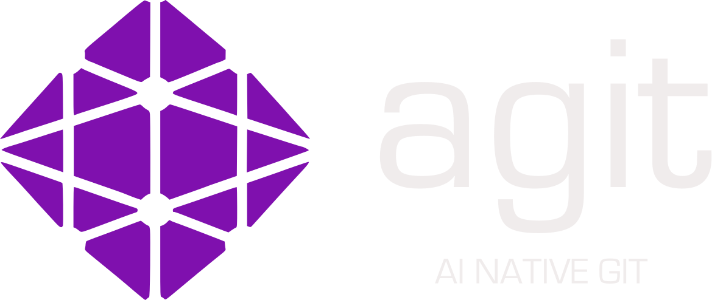

<p align="left">
  
</p>

# agit - AI-Native Git Wrapper

> "Code is the Artifact. Context is the Source."

**[Documentation](https://agit-stuff.github.io/) · [GitHub](https://github.com/agit-stuff/agit)**

agit captures the **reasoning context** (Why/How) alongside your **code changes** (What). It creates a "Neural Graph" parallel to Git's commit graph, giving you and your team a complete history of not just what changed, but *why* it changed and *how* the decision was made.

## Features

- **Seamless Integration** - Works with Cursor and Claude Code out of the box
- **Zero Configuration** - Just run `agit init` and MCP is auto-configured
- **MCP Auto-Discovery** - Generates `.mcp.json` and `.cursor/mcp.json` automatically
- **Git Compatible** - Built on libgit2, works alongside your existing Git workflow
- **Git Resilience** - Handles amend, rebase, and branch switching gracefully

## Installation

### macOS (Homebrew)

```bash
brew tap agit-stuff/agit
brew install agit
```

### Windows (Scoop)

```powershell
scoop bucket add agit https://github.com/agit-stuff/agit
scoop install agit
```

### Linux / macOS / CI

```bash
curl -fsSL https://raw.githubusercontent.com/agit-stuff/agit/main/install.sh | bash
```

### From Source (Cargo)

```bash
cargo install agit
```

## Quick Start

```bash
# Initialize in your git repository
cd your-project
agit init

# Your AI assistant will now automatically log thoughts via MCP
# Or manually record thoughts:
agit record "Planning to refactor the auth module"

# After making changes, stage and commit with context:
agit add .
agit commit -m "Refactor auth module"  # Creates both git + neural commit

# View history with context:
agit log
```

## How It Works

### The "Seamless Echo" Strategy

agit inverts the traditional approach. Instead of the CLI calling LLMs, your **AI editor** (Cursor, Claude, etc.) pushes context to agit via MCP:

1. **User asks:** "Fix the auth bug"
2. **AI logs intent:** `agit_log_step(role="user", content="Fix auth bug")`
3. **AI plans:** "I'll add a try/catch block"
4. **AI logs plan:** `agit_log_step(role="ai", content="Plan: Add try/catch")`
5. **User commits:** `agit commit -m "Fix auth bug"`
6. **agit synthesizes:** Links the Intent + Plan to the git commit

### What Gets Created

When you run `agit init`, these files are generated:

```
your-project/
├── .agit/              # Neural graph storage (like .git)
│   ├── objects/        # Content-addressable store
│   ├── refs/heads/     # Branch pointers
│   └── index           # Staging area
├── .mcp.json           # MCP config for Claude Code (auto-detected)
├── .cursor/
│   └── mcp.json        # MCP config for Cursor (auto-detected)
├── CLAUDE.md           # AI instructions (appended if exists)
└── .cursorrules        # AI instructions (appended if exists)
```

**Note:** If you already have `CLAUDE.md` or `.cursorrules` files, agit appends its policy rather than overwriting your content.

## Commands

| Command | Description |
|---------|-------------|
| `agit init` | Initialize agit in a git repository |
| `agit record <msg>` | Manually record a thought |
| `agit add [path]` | Stage files and freeze context for commit |
| `agit status` | Show current status and pending thoughts |
| `agit commit -m <msg>` | Create git commit + neural commit with context |
| `agit log` | View commit history with summaries |
| `agit show [hash]` | Show full context for a commit |
| `agit search <query>` | Search past reasoning |
| `agit server` | Start the MCP server |

## Philosophy

Traditional version control captures the **what** (code changes) but loses the **why** (reasoning). agit fills this gap by:

1. **Capturing Intent** - What the user wanted to achieve
2. **Recording Reasoning** - How the AI (or human) decided to approach it
3. **Linking Context** - Connecting thoughts to specific code changes
4. **Preserving History** - Making the reasoning queryable forever

This creates a "dual graph" where:
- **Git Graph** = Code changes over time
- **Neural Graph** = Reasoning behind those changes

## Architecture

```
┌─────────────────────────────────────────────────────────┐
│                    AI Editor (Cursor/Claude)            │
│  ┌─────────────────────────────────────────────────┐   │
│  │  User: "Fix the auth bug"                       │   │
│  │  AI: [Logs intent via MCP]                      │   │
│  │  AI: "I'll add a try/catch block"               │   │
│  │  AI: [Logs reasoning via MCP]                   │   │
│  │  AI: [Writes code]                              │   │
│  └─────────────────────────────────────────────────┘   │
└─────────────────────┬───────────────────────────────────┘
                      │ MCP (agit_log_step)
                      ▼
┌─────────────────────────────────────────────────────────┐
│                    agit MCP Server                      │
│  ┌─────────────────────────────────────────────────┐   │
│  │  Receives: role, category, content              │   │
│  │  Appends to: .agit/index                        │   │
│  └─────────────────────────────────────────────────┘   │
└─────────────────────┬───────────────────────────────────┘
                      │
                      ▼
┌─────────────────────────────────────────────────────────┐
│                    agit commit                          │
│  ┌─────────────────────────────────────────────────┐   │
│  │  1. Read .agit/index                            │   │
│  │  2. Synthesize summary (Intent + Plan)          │   │
│  │  3. Create trace blob                           │   │
│  │  4. Create git commit (from staged changes)     │   │
│  │  5. Create NeuralCommit (linked to git commit)  │   │
│  │  6. Update refs                                 │   │
│  └─────────────────────────────────────────────────┘   │
└─────────────────────────────────────────────────────────┘
```

## Contributing

See [CONTRIBUTING.md](CONTRIBUTING.md) for development setup and guidelines.

## License

Licensed under either of:

- Apache License, Version 2.0 ([LICENSE-APACHE](LICENSE-APACHE) or http://www.apache.org/licenses/LICENSE-2.0)
- MIT license ([LICENSE-MIT](LICENSE-MIT) or http://opensource.org/licenses/MIT)

at your option.
